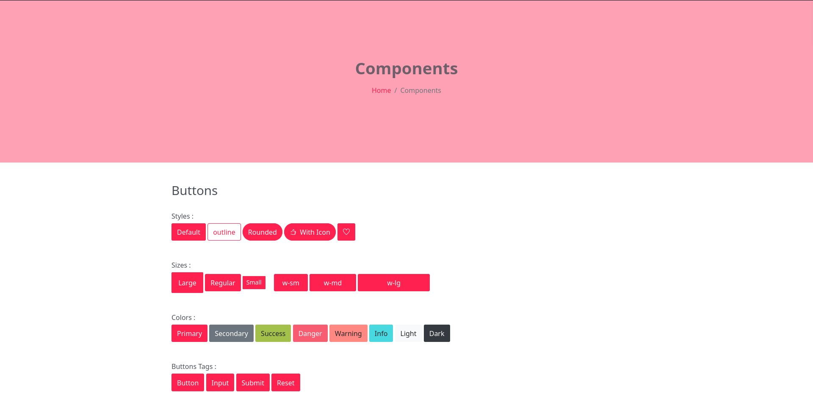
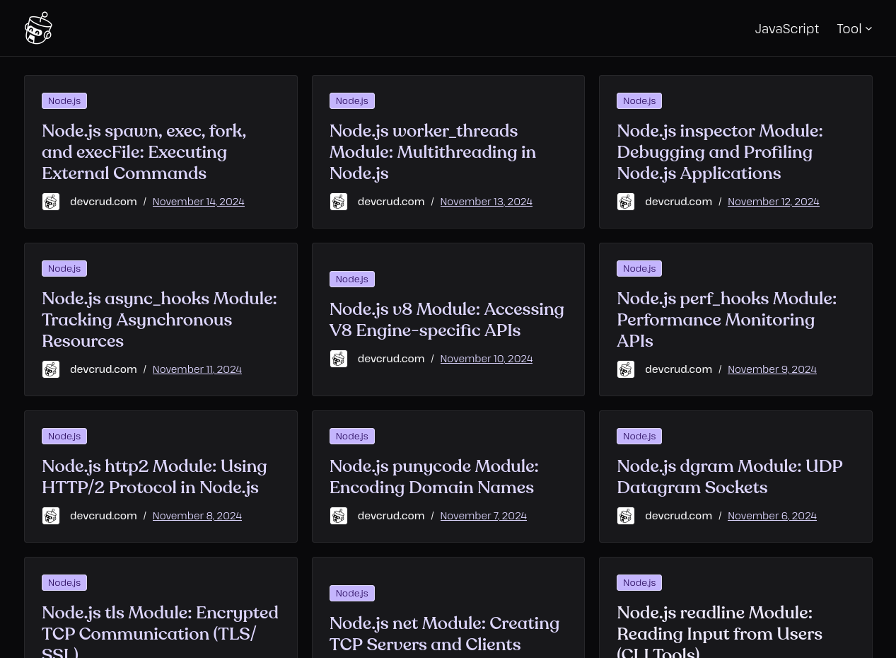
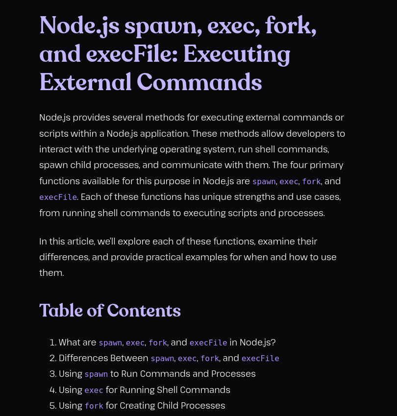
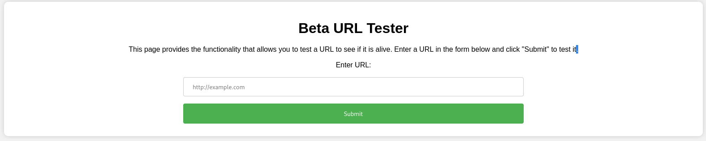
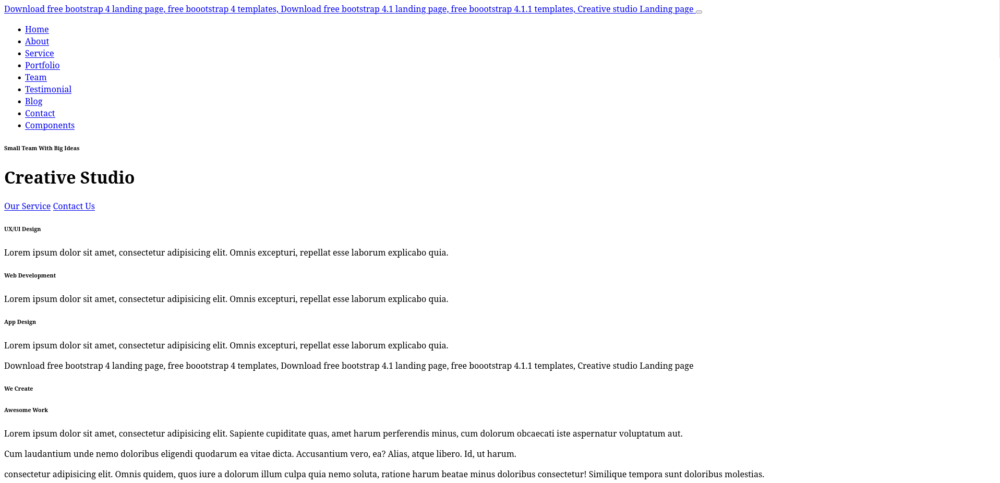

# Creative

This room is a red challenge which is tagged in the categories **Linux and Web**. The description tells us to exploit the vulnerable web application and some misconfigurations to gain root privileges.

## Recon

We start by doing a normal port scan with Nmap and find 2 open ports, **SSH on port 22** and **HTTP on port 80** as is the usual in this kind of challenges. I will leave an all port scan so we can find if there's something open on the ports that aren't in the top 1000.

```
sudo nmap -T4 -sVC 10.10.94.69    
Starting Nmap 7.95 ( https://nmap.org ) at 2025-07-27 14:24 EEST
Nmap scan report for 10.10.94.69
Host is up (0.058s latency).
Not shown: 998 filtered tcp ports (no-response)
PORT   STATE SERVICE VERSION
22/tcp open  ssh     OpenSSH 8.2p1 Ubuntu 4ubuntu0.11 (Ubuntu Linux; protocol 2.0)
| ssh-hostkey: 
|   3072 19:d1:1c:d4:ae:b4:c5:26:d9:8c:08:80:fe:12:09:01 (RSA)
|   256 45:fc:56:e7:7d:a8:af:06:94:4a:3d:16:66:81:af:73 (ECDSA)
|_  256 84:99:1b:25:0e:da:5b:62:42:99:b2:0e:7e:bc:00:94 (ED25519)
80/tcp open  http    nginx 1.18.0 (Ubuntu)
|_http-server-header: nginx/1.18.0 (Ubuntu)
|_http-title: Did not follow redirect to http://creative.thm
Service Info: OS: Linux; CPE: cpe:/o:linux:linux_kernel

Service detection performed. Please report any incorrect results at https://nmap.org/submit/ .
Nmap done: 1 IP address (1 host up) scanned in 17.45 seconds
```

We will start by adding creative.thm in our /etc/hosts file and try and access the page on our browser to see how the page is looking. We are being greeted by a page that seems to be presenting a business.


I will navigate the page manually to see if I find anything interesting and at the same time I'll be doing a dirsearch to see if there are any hidden pages that we would be interested in:

```
dirsearch -u http://creative.thm/ -r -w /usr/share/wordlists/seclists/Discovery/Web-Content/raft-medium-directories.txt

  _|. _ _  _  _  _ _|_    v0.4.3
 (_||| _) (/_(_|| (_| )

Extensions: php, aspx, jsp, html, js | HTTP method: GET | Threads: 25 | Wordlist size: 29999

Output File: /home/piscu/random/reports/http_creative.thm/__25-07-27_14-32-01.txt

Target: http://creative.thm/

[14:32:01] Starting: 
[14:32:03] 301 -  178B  - /assets  ->  http://creative.thm/assets/
Added to the queue: assets/

[14:34:46] Starting: assets/
[14:34:47] 301 -  178B  - /assets/js  ->  http://creative.thm/assets/js/
Added to the queue: assets/js/
[14:34:47] 301 -  178B  - /assets/css  ->  http://creative.thm/assets/css/
Added to the queue: assets/css/
[14:34:49] 301 -  178B  - /assets/imgs  ->  http://creative.thm/assets/imgs/
Added to the queue: assets/imgs/
[14:34:52] 301 -  178B  - /assets/vendors  ->  http://creative.thm/assets/vendors/
Added to the queue: assets/vendors/

[14:37:08] Starting: assets/js/

[14:39:32] Starting: assets/css/

[14:42:05] Starting: assets/imgs/

[14:44:27] Starting: assets/vendors/
[14:44:30] 301 -  178B  - /assets/vendors/jquery  ->  http://creative.thm/assets/vendors/jquery/
Added to the queue: assets/vendors/jquery/

[14:46:46] Starting: assets/vendors/jquery/

Task Completed
```

We didn't really find anything interesting at the first glance on the site, neither on the dirsearch I've just done. All the /assets/ pages just give 403 Forbidden when you try to search for something. There is another page named components.html that doesn't have anything interesting, just templates for the website.



One of the things that made me curious on this page is in the "About Us" section which has a clickable link redirecting you to the "developers" of the page:


This page when you enter it presents you a lot of articles about Node.js and especially some about the vulnerabilities that can be found in those types of apps, **this could be a huge hint for us**.



While I look through the articles I will start to enumerate subdomains because these pages don't really seem that helpful at this point.

It seems like we were **successful** in our subdomain enumeration because we found another one for our machine!

```
ffuf -w /usr/share/wordlists/seclists/Discovery/DNS/subdomains-top1million-110000.txt -u http://creative.thm/ -H "Host:FUZZ.creative.thm" -fs 178

        /'___\  /'___\           /'___\       
       /\ \__/ /\ \__/  __  __  /\ \__/       
       \ \ ,__\\ \ ,__\/\ \/\ \ \ \ ,__\      
        \ \ \_/ \ \ \_/\ \ \_\ \ \ \ \_/      
         \ \_\   \ \_\  \ \____/  \ \_\       
          \/_/    \/_/   \/___/    \/_/       

       v2.1.0-dev
________________________________________________

 :: Method           : GET
 :: URL              : http://creative.thm/
 :: Wordlist         : FUZZ: /usr/share/wordlists/seclists/Discovery/DNS/subdomains-top1million-110000.txt
 :: Header           : Host: FUZZ.creative.thm
 :: Follow redirects : false
 :: Calibration      : false
 :: Timeout          : 10
 :: Threads          : 40
 :: Matcher          : Response status: 200-299,301,302,307,401,403,405,500
 :: Filter           : Response size: 178
________________________________________________

beta                    [Status: 200, Size: 591, Words: 91, Lines: 20, Duration: 62ms]
:: Progress: [114441/114441] :: Job [1/1] :: 694 req/sec :: Duration: [0:02:56] :: Errors: 0 ::
```

We add it to our /etc/hosts file and look up the page to see what it has for us. It seems like the page is a "Beta URL Tester" which provides functionality to provide an URL and see if the page is alive or not. Maybe this has something to do with the article from the DevCRUD website that we saw at the beggining? The most obvious one in my opinion is the article about spawn, exec, fork and execFile commands, which execute external commands/files.





This is the source code for the beta application and we see all the JS scripts are server-sided.

```
<!DOCTYPE html>
<html>
<head>
  <title>URL Tester</title>
  <link rel="stylesheet" type="text/css" href="css/style.css">
</head>
<body>
  <div class="container">
    <h1>Beta URL Tester</h1>
    <p>This page provides the functionality that allows you to test a URL to see if it is alive. Enter a URL in the form below and click "Submit" to test it.</p>
    <form action="/" method="POST">
      <label for="url">Enter URL:</label>
      <input type="text" id="url" name="url" placeholder="http://example.com">
      <input type="submit" value="Submit">
    </form>
  </div>
</body>
</html>
```

We need to firstly test the functionality and see how it interprets everything we seend by the form. I tried sending http://creative.thm and see what the website tells us. It just shows us the raw HTML page:

