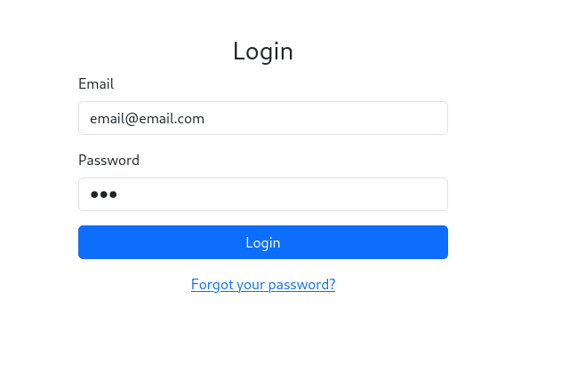
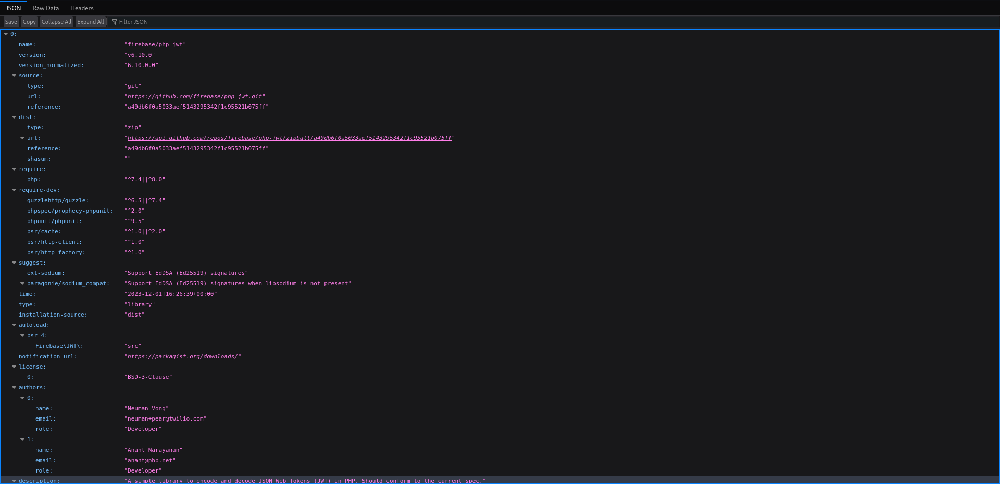

# Hammer

This is a **medium** TryHackMe room in the **web category** which says we need to use our exploitation skills to bypass the authentication mechanisms on the website and finally **get RCE on the machine.**

## Recon

We start like usual with a port scan on the machine:

```
sudo nmap -sVC hammer.thm              
Starting Nmap 7.95 ( https://nmap.org ) at 2025-07-29 12:32 EEST
Nmap scan report for hammer.thm (10.10.150.71)
Host is up (0.069s latency).
Not shown: 999 closed tcp ports (reset)
PORT   STATE SERVICE VERSION
22/tcp open  ssh     OpenSSH 8.2p1 Ubuntu 4ubuntu0.11 (Ubuntu Linux; protocol 2.0)
| ssh-hostkey: 
|   3072 c0:df:cc:a9:1e:4b:8c:e2:f2:ce:1f:47:29:a7:f0:35 (RSA)
|   256 55:96:38:65:ad:b0:8c:14:1f:ff:5b:9c:45:47:b7:d6 (ECDSA)
|_  256 85:eb:a4:7a:26:70:80:5c:ce:53:e1:99:e7:8a:7d:b3 (ED25519)
Service Info: OS: Linux; CPE: cpe:/o:linux:linux_kernel
```

We find only **port 22 for SSH** , but since we know this is a web challenge we need to go further than the top 1000 ports. I'll do a Syn Scan on all ports with -Pn to not ping the targets so we don't waste a lot of time and then a -sVC for version and default scripts on the ports we find:

```
ting Nmap 7.95 ( https://nmap.org ) at 2025-07-29 12:32 EEST
Nmap scan report for hammer.thm (10.10.150.71)
Host is up (0.074s latency).
Not shown: 65533 closed tcp ports (reset)
PORT     STATE SERVICE
22/tcp   open  ssh
1337/tcp open  waste

sudo nmap -sVC -p 22,1337 hammer.thm
Starting Nmap 7.95 ( https://nmap.org ) at 2025-07-29 12:33 EEST
Nmap scan report for hammer.thm (10.10.150.71)
Host is up (0.067s latency).
PORT     STATE SERVICE VERSION
22/tcp   open  ssh     OpenSSH 8.2p1 Ubuntu 4ubuntu0.11 (Ubuntu Linux; protocol 2.0)
| ssh-hostkey: 
|   3072 c0:df:cc:a9:1e:4b:8c:e2:f2:ce:1f:47:29:a7:f0:35 (RSA)
|   256 55:96:38:65:ad:b0:8c:14:1f:ff:5b:9c:45:47:b7:d6 (ECDSA)
|_  256 85:eb:a4:7a:26:70:80:5c:ce:53:e1:99:e7:8a:7d:b3 (ED25519)
1337/tcp open  http    Apache httpd 2.4.41 ((Ubuntu))
| http-cookie-flags: 
|   /: 
|     PHPSESSID: 
|_      httponly flag not set
|_http-server-header: Apache/2.4.41 (Ubuntu)
|_http-title: Login
Service Info: OS: Linux; CPE: cpe:/o:linux:linux_kernel

Service detection performed. Please report any incorrect results at https://nmap.org/submit/ .
Nmap done: 1 IP address (1 host up) scanned in 15.01 seconds
```

We enter the page and we see a basic authentication portal.



I'll intercept the request in burp, save it into a file in my computer and what I like to do first is to sqlmap it so maybe we get some database dumps.

```
POST / HTTP/1.1
Host: hammer.thm:1337
User-Agent: Mozilla/5.0 (X11; Linux x86_64; rv:128.0) Gecko/20100101 Firefox/128.0
Accept: text/html,application/xhtml+xml,application/xml;q=0.9,*/*;q=0.8
Accept-Language: en-US,en;q=0.5
Accept-Encoding: gzip, deflate, br
Content-Type: application/x-www-form-urlencoded
Content-Length: 36
Origin: http://hammer.thm:1337
Connection: keep-alive
Referer: http://hammer.thm:1337/
Cookie: PHPSESSID=nf1idpuolvr30lbqtnpk50fg8s
Upgrade-Insecure-Requests: 1
Priority: u=0, i

email=email%40email.com&password=asd

sqlmap -r login.req --batch --dbs --level=5 --risk=3
```

In the login.req file we replace the email section with a '*' so the sqlmap does it's tests in the email portion of the login request. While we're waiting for results we check source code for any things that may be left by mistake and try different payloads on it. We enter the forgot password section and we see that that file is .php so we can start with that while doing the dirsearch.

We weren't successful with the sqlmap, so I'm gonna continue doing the dirsearch because we don't have any possible e-mails that could help us. While doing our dirsearch we discovered these:

```
dirsearch -u http://hammer.thm:1337/ -r

  _|. _ _  _  _  _ _|_    v0.4.3
 (_||| _) (/_(_|| (_| )

Extensions: php, aspx, jsp, html, js | HTTP method: GET | Threads: 25 | Wordlist size: 11460

Output File: /home/piscu/random/reports/http_hammer.thm_1337/__25-07-29_12-56-38.txt

Target: http://hammer.thm:1337/

[12:56:38] Starting: 
[12:56:43] 403 -  277B  - /.ht_wsr.txt
[12:56:43] 403 -  277B  - /.htaccess.bak1
[12:56:43] 403 -  277B  - /.htaccess.sample
[12:56:43] 403 -  277B  - /.htaccess.orig
[12:56:43] 403 -  277B  - /.htaccess.save
[12:56:43] 403 -  277B  - /.htaccess_extra
[12:56:43] 403 -  277B  - /.htaccess_orig
[12:56:43] 403 -  277B  - /.htaccess_sc
[12:56:43] 403 -  277B  - /.htaccessBAK
[12:56:43] 403 -  277B  - /.htaccessOLD2
[12:56:43] 403 -  277B  - /.htaccessOLD
[12:56:43] 403 -  277B  - /.htm
[12:56:43] 403 -  277B  - /.html
[12:56:43] 403 -  277B  - /.htpasswd_test
[12:56:43] 403 -  277B  - /.htpasswds
[12:56:43] 403 -  277B  - /.httr-oauth
[12:56:46] 403 -  277B  - /.php
[12:57:16] 200 -   63B  - /composer.json
[12:57:16] 200 -    0B  - /config.php
[12:57:20] 302 -    0B  - /dashboard.php  ->  logout.php
[12:57:31] 301 -  320B  - /javascript  ->  http://hammer.thm:1337/javascript/
Added to the queue: javascript/
[12:57:36] 302 -    0B  - /logout.php  ->  index.php
[12:57:42] 301 -  320B  - /phpmyadmin  ->  http://hammer.thm:1337/phpmyadmin/
Added to the queue: phpmyadmin/
[12:57:44] 200 -    3KB - /phpmyadmin/doc/html/index.html
[12:57:44] 200 -    3KB - /phpmyadmin/
[12:57:44] 200 -    3KB - /phpmyadmin/index.php
[12:57:48] 403 -  277B  - /server-status/
Added to the queue: server-status/
[12:57:48] 403 -  277B  - /server-status
[12:58:00] 200 -  498B  - /vendor/
[12:58:00] 200 -    0B  - /vendor/composer/autoload_psr4.php
[12:58:00] 200 -    0B  - /vendor/autoload.php
[12:58:00] 200 -    0B  - /vendor/composer/autoload_real.php
[12:58:00] 200 -    0B  - /vendor/composer/autoload_classmap.php
[12:58:00] 200 -    2KB - /vendor/composer/installed.json
[12:58:00] 200 -    0B  - /vendor/composer/ClassLoader.php
[12:58:00] 200 -    0B  - /vendor/composer/autoload_namespaces.php
[12:58:00] 200 -    1KB - /vendor/composer/LICENSE
[12:58:00] 200 -    0B  - /vendor/composer/autoload_static.php
```

Interesting here in my opinion is the config.php, but it's empty, and while searching through them I found that the composer.json and /vendor/composer/installed.json files tells us about the installed packages and their versions.



This tells us that the application uses firebase/php-jwt v6.10.0 which is a widely used PHP library to encode/decode JSON Web Tokens. 